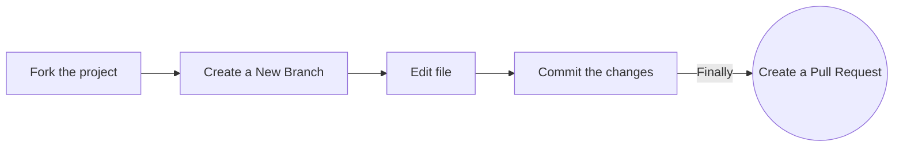

# 🍽️ RecipeApp

Welcome to **RecipeApp** — a React-based application where you can explore, search, and save delicious recipes from various cuisines. Whether you're a beginner cook or an experienced chef, RecipeApp helps you find inspiration for your next meal!

## 🌟 Features

- 🔍 **Search Recipes**: Easily search for recipes by ingredients or meal types
- ⭐ **Save Favorites**: Bookmark your favorite recipes for quick access
- 🥗 **Explore Cuisines**: Discover a wide range of cuisines from different cultures
- 📱 **Responsive Design**: Access RecipeApp seamlessly on both desktop and mobile

## 🚀 Getting Started

### Prerequisites

- Node.js installed
- Git installed

### Installation

1. Clone the repository:
   ```bash
   git clone https://github.com/rudalkunwar/recipe-app.git
   ```

2. Navigate to the project directory:
   ```bash
   cd recipe-app
   ```

3. Install dependencies:
   ```bash
   npm install
   ```

4. Run the app locally:
   ```bash
   npm start
   ```

5. Open in browser:
   - Visit http://localhost:3000

## 📦 API Integration

To integrate with the recipe API:

1. Obtain an API key from Spoonacular (or your preferred recipe API)
2. Create a `.env` file in the project root:
   ```
   REACT_APP_API_KEY=your_api_key_here
   ```

## 🛠️ Technology Stack

- **React.js**: Frontend framework
- **Axios**: API client
- **CSS Modules/Tailwind CSS**: Styling
- **Spoonacular API**: Recipe data source

## 🤝 Contributing

We welcome contributions! Here's how to get started:

1. Fork the repository
2. Create a feature branch:
   ```bash
   git checkout -b feature-name
   ```
3. Make your changes
4. Stage and commit:
   ```bash
   git add .
   git commit -m "Description of changes"
   ```
5. Push to your fork:
   ```bash
   git push origin feature-name
   ```
6. Submit a pull request

### Contribution Guidelines

1. Check existing [Issues](https://github.com/rudalkunwar/recipe-app/issues) or create new ones
2. Wait for issue assignment before starting work
3. Fork the repository
4. Create a new branch for your feature
5. Make changes and test thoroughly
6. Include screenshots with pull requests where relevant



## 🎉 Hacktoberfest 2024

We're participating in **Hacktoberfest 2024**! Look for issues labeled `hacktoberfest` to contribute. All valid pull requests are welcome!

## 📚 Additional Resources

New to Git and GitHub? Check out these helpful articles:

- [Getting started with Git and GitHub](https://towardsdatascience.com/getting-started-with-git-and-github-6fcd0f2d4ac6)
- [Forking a Repo](https://help.github.com/en/github/getting-started-with-github/fork-a-repo)
- [Cloning a Repo](https://help.github.com/en/desktop/contributing-to-projects/creating-a-pull-request)
- [How to create a Pull Request](https://opensource.com/article/19/7/create-pull-request-github)

## ❤️ Code of Conduct

Please note that this project follows a [Contributor Code of Conduct](./CODE_OF_CONDUCT.md). By participating in this project online or at events, you agree to abide by its terms.

## 📄 License

This project is licensed under the MIT License - see the [LICENSE](LICENSE) file for details.

## ❤️ Acknowledgments

A heartfelt thank you to the following individuals for their valuable contributions to **RecipeApp**. Your support and dedication are greatly appreciated:

<a href="https://github.com/rudalkunwar/recipe-app/graphs/contributors">
  
</a>

<div align="center">
    <a href="#top">
        
    </a>
</div>


---

⭐ Give us a star if this project helped you!

Happy Cooking! 🍳👩‍🍳👨‍🍳